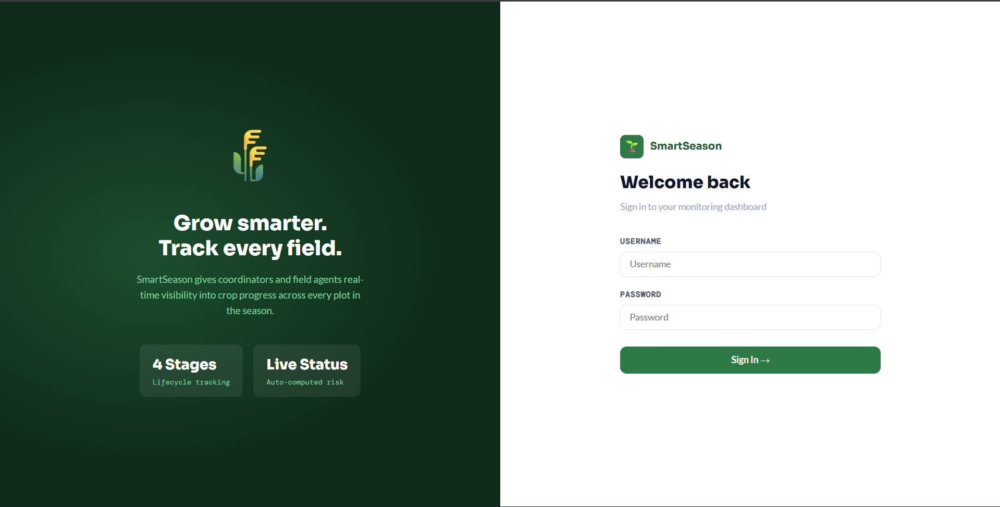
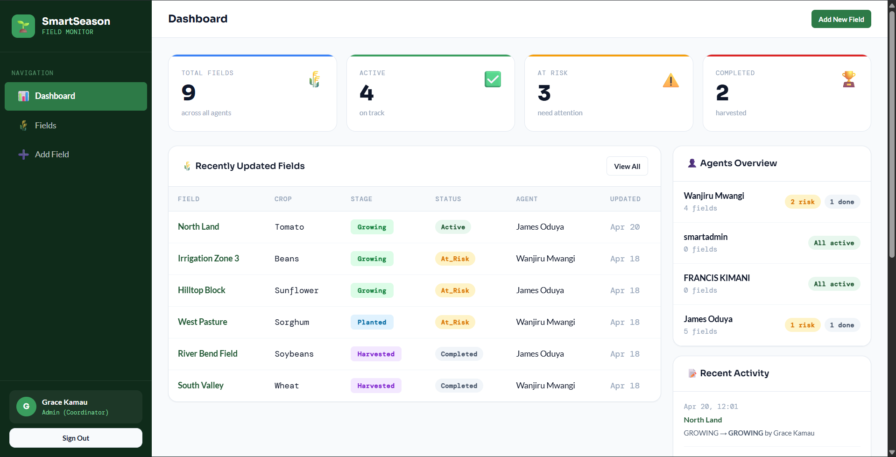
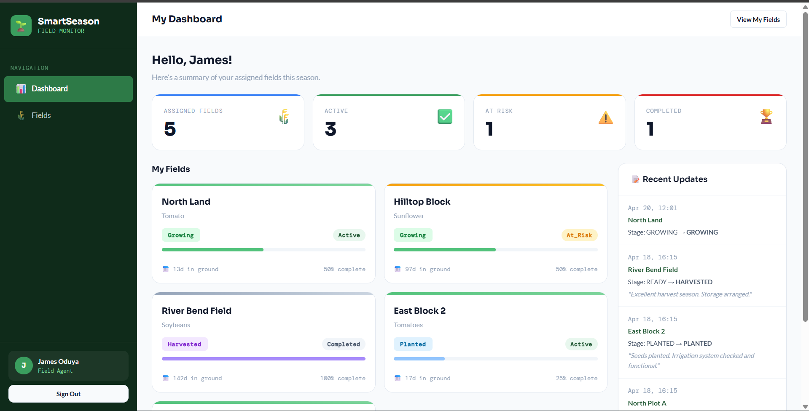
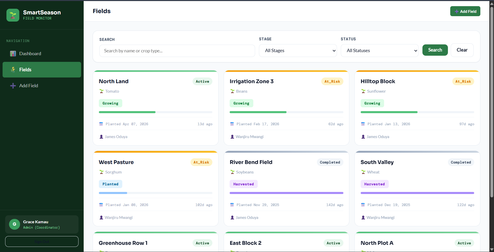
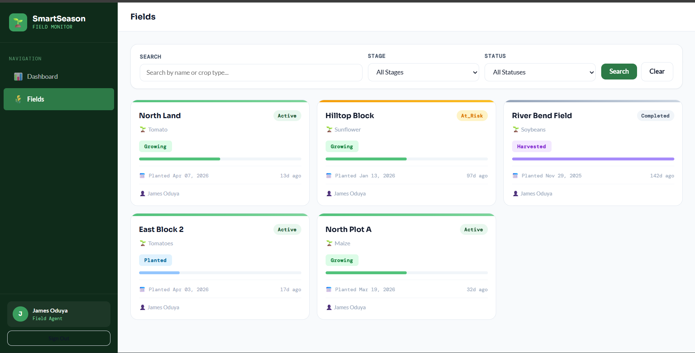
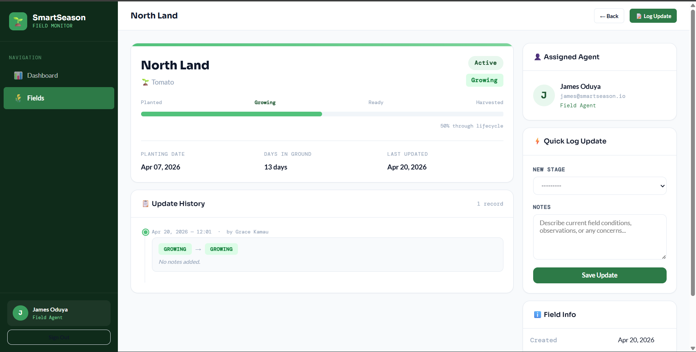

# 🌾 SmartSeason Field Monitoring System

A production-quality Django application for tracking crop progress across multiple fields during a growing season. Designed for both field agents and coordinators, it features role-based access, computed lifecycle statuses, detailed update histories, and comprehensive dashboards.

---

## Application Screenshots

### Authentication


### Dashboards

**Admin View**


**Agent View**  


### Field List Page
**Admin View**


**Agent View**  


### Field Management



To see the UI live, run the app locally with the included seed data — setup takes under 3 minutes.

The app includes:
- **Login page** with demo credentials displayed inline
- **Admin dashboard** — stat cards, field table, per-agent breakdown, activity feed
- **Agent dashboard** — personal field grid with progress bars, at-risk alerts
- **Field detail page** — lifecycle progress bar, agent info, quick update form, full timeline
- **Field list page** — search + stage/status filters, card grid with pagination (12 fields per page)

---

## Features

**Role-Based Access**
- **Admin (Coordinator)** — full access: create/edit fields, assign agents, view all updates and the global dashboard
- **Field Agent** — scoped access: view and update only their assigned fields, personal dashboard

**Field Lifecycle Tracking**
- Four-stage progression: Planted → Growing → Ready → Harvested
- Computed status (Active / At Risk / Completed) — dynamically derived, never stored in the DB
- Full timestamped update history per field with agent attribution

**Dashboards**
- Admin: total/active/at-risk/completed counts, per-agent breakdown, recent activity feed
- Agent: personal field summary, at-risk alerts, quick update links

**REST API (Django REST Framework)**
- Token + Session authentication
- Role-aware endpoints — agents only see their own fields
- Full field CRUD, update logging, and dashboard summary endpoints

---

## Tech Stack

| Layer         | Technology                              |
|---------------|-----------------------------------------|
| Backend       | Django 5 + Django REST Framework 3.15   |
| Database      | PostgreSQL — locally and in production  |
| Frontend      | Django Templates + Custom CSS design system |
| Auth          | Django built-in + DRF Token Auth        |
| Testing       | Django TestCase — 17 tests              |
| Deployment    | Render / Railway ready                  |

---

## Architecture Flow

Every request — whether from the browser or the REST API — follows the same path through the same service layer:

```
Browser / API client
        │
        ▼
  View or API View          ← thin: handles HTTP, auth, redirects
        │
        ▼
  fields/services.py        ← all business logic lives here
        │
        ▼
  Model (@property)         ← computed_status derived here, never stored
        │
        ▼
    PostgreSQL               ← indexes on agent, stage, planting_date
```

Both the server-rendered views and the DRF API endpoints call the same service functions (`filter_fields`, `create_field_update`, `get_admin_summary`). This means the two surfaces share a single source of truth for business logic and cannot diverge.

---

## Why Server-Rendered Django (No React/SPA)

This project uses Django templates rather than a React frontend. That was a deliberate tradeoff, not a limitation:

**Faster development velocity.** A server-rendered Django app eliminates the API-contract surface between frontend and backend entirely. For an internal operations tool like this, that is not a shortcut — it is the right fit.

**Simpler deployment.** One process, one repository, no build pipeline, no CORS configuration. The entire app deploys with `gunicorn core.wsgi` on a single instance.

**Better fit for the user.** Field agents on slow connections benefit from full-page server renders over client-side hydration. The primary users are logging field updates on a mobile device between tasks, not running a dashboard in a browser tab.

**Reduced operational complexity.** A React SPA makes sense when you have a dedicated frontend team or need rich client-side interactivity. This is an internal operations tool — Django templates with a clean CSS system deliver the same value at a fraction of the complexity.

The DRF API layer is still included so the same backend can power a mobile app or third-party integration later without any changes to the core logic.

---

## Status Logic

Field status is a **computed `@property`** on the `Field` model. It is **intentionally never stored in the database** — it is derived fresh from the actual field data on every access, which means it cannot go stale.

```
if current_stage == HARVESTED:
    → COMPLETED

elif days_since_planting > 90 AND stage is PLANTED or GROWING:
    → AT_RISK

elif no updates in the last 14 days (or no updates ever, planted > 14 days ago):
    → AT_RISK

else:
    → ACTIVE
```

**Why not persist it?** Storing computed status creates a dual source of truth. Any write to planting date, stage, or last update timestamp would require a secondary write to keep a status column in sync — and that sync can fail silently. As a `@property`, the value is always derived from facts already in the database, with no additional state to manage.

---

## Database Indexing

Four indexes are defined on `Field` to support the most common query patterns:

```python
class Meta:
    indexes = [
        # Agent-scoped field list — the most frequent query for logged-in agents
        models.Index(fields=['assigned_agent'], name='idx_field_agent'),

        # Stage filtering on list and dashboard views
        models.Index(fields=['current_stage'], name='idx_field_stage'),

        # AT_RISK computation: planting_date age check runs on every status eval
        models.Index(fields=['planting_date'], name='idx_field_planting_date'),

        # Compound: agent + stage for filtered agent-scoped views
        models.Index(fields=['assigned_agent', 'current_stage'], name='idx_field_agent_stage'),
    ]
```

`FieldUpdate` is indexed on `(field, -created_at)` for efficient per-field timeline queries, and on `-created_at` alone for the admin activity feed.

---

## Security

| Area | Implementation |
|------|----------------|
| CSRF | `CsrfViewMiddleware` enabled — all state-changing forms and API mutations are protected |
| Authentication | Every view and endpoint requires authentication via `LoginRequiredMixin` or `IsAuthenticated` |
| Role enforcement | Enforced at both UI level (`AdminRequiredMixin` mixin) and API level (per-view permission checks) |
| Agent isolation | Agents requesting another agent's field receive 404, not 403 — avoids leaking field existence |
| Secret management | `SECRET_KEY`, database credentials, and `DEBUG` flag are environment variables — never hardcoded |
| Password validation | Django's built-in validators enforce minimum length, similarity, and common-password rules |

---

## REST API

### Get a token

```bash
curl -X POST http://localhost:8000/api/login/ \
  -H "Content-Type: application/json" \
  -d '{"username": "admin", "password": "admin1234"}'
```

```json
{
  "token": "9944b09199c62bcf9418ad846dd0e4bbdfc6ee4b",
  "user": { "id": 1, "username": "admin", "role": "ADMIN" }
}
```

### Field response shape

```json
{
  "id": 1,
  "name": "North Plot A",
  "crop_type": "Maize",
  "planting_date": "2025-03-19",
  "current_stage": "GROWING",
  "computed_status": "ACTIVE",
  "stage_progress": 50,
  "days_since_planted": 30,
  "assigned_agent": {
    "id": 2,
    "username": "agent_james",
    "first_name": "James",
    "last_name": "Oduya",
    "role": "FIELD_AGENT"
  },
  "latest_update": {
    "id": 1,
    "previous_stage": "PLANTED",
    "new_stage": "GROWING",
    "notes": "Good germination, soil moisture adequate.",
    "created_at": "2025-03-29T09:14:00Z"
  }
}
```

### Endpoints

| Method | Endpoint | Description | Access |
|--------|----------|-------------|--------|
| `POST` | `/api/login/` | Get auth token | Public |
| `GET`  | `/api/fields/` | List fields | Scoped by role |
| `POST` | `/api/fields/` | Create field | Admin only |
| `GET`  | `/api/fields/{id}/` | Field detail | Scoped by role |
| `PUT`  | `/api/fields/{id}/` | Update field metadata | Admin only |
| `GET`  | `/api/fields/{id}/updates/` | List update history | Scoped by role |
| `POST` | `/api/fields/{id}/updates/` | Log a stage update | Agent + Admin |
| `GET`  | `/api/dashboard/admin/` | Admin summary stats | Admin only |
| `GET`  | `/api/dashboard/agent/` | Agent summary stats | All authenticated |

---

## Setup Instructions

> **From clone to running locally takes about 3 minutes** — PostgreSQL must already be installed and running.

- Python 3.11+
- PostgreSQL 14+ running locally

### 1. Clone and install

```bash
git clone <repo-url>
cd smartseason
python -m venv venv
source venv/bin/activate    # Windows: venv\Scripts\activate
pip install -r requirements.txt
```

### 2. Configure environment

```bash
cp .env.example .env
# Edit .env — set your PostgreSQL credentials
```

Minimum required in `.env`:
```env
SECRET_KEY=any-random-string-for-local-dev
DEBUG=True
DB_NAME=smartseason
DB_USER=postgres
DB_PASSWORD=yourpassword
```

### 3. Create the database and migrate

```bash
psql -U postgres -c "CREATE DATABASE smartseason;"
python manage.py migrate
python manage.py seed_data
```

### 4. Run

```bash
python manage.py runserver
# Visit http://localhost:8000
```

---

## Demo Credentials

| Role | Username | Password |
|------|----------|----------|
| Admin (Coordinator) | `admin` | `admin1234` |
| Field Agent | `agent_james` | `agent1234` |
| Field Agent | `agent_wanjiru` | `agent1234` |

Credentials are also shown on the login page.

---

## Sample Seed Data

Running `python manage.py seed_data` creates a realistic dataset that covers every status and stage combination so you can explore the full UI immediately:

| Field | Crop | Stage | Status | Agent |
|-------|------|-------|--------|-------|
| North Plot A | Maize | Growing | Active | agent_james |
| East Block 2 | Tomatoes | Planted | Active | agent_james |
| Greenhouse Row 1 | Peppers | Ready | Active | agent_wanjiru |
| South Valley | Wheat | Harvested | Completed | agent_wanjiru |
| River Bend Field | Soybeans | Harvested | Completed | agent_james |
| West Pasture | Sorghum | Planted | At Risk | agent_wanjiru |
| Hilltop Block | Sunflower | Growing | At Risk | agent_james |
| Irrigation Zone 3 | Beans | Growing | Active | agent_wanjiru |

Six historical field updates are also seeded with realistic notes, so the update timeline on field detail pages is populated from the start. The At Risk fields are constructed with planting dates older than 90 days to demonstrate the status logic working as intended.

## Running Tests

```bash
python manage.py test fields --verbosity=2
```

17 tests across four suites:

- **`FieldStatusLogicTest`** — all branches of computed_status
- **`FieldUpdateServiceTest`** — stage mutation and audit record creation
- **`PermissionsTest`** — role access, agent isolation, unauthenticated redirects
- **`SummaryServiceTest`** — admin and agent dashboard aggregations

---

## Project Structure

```
smartseason/
├── core/                        # Django project config
│   ├── settings.py              # PostgreSQL-only, DRF, auth, static
│   └── urls.py
│
├── accounts/                    # Custom User model + auth views
│   └── models.py                # User with role: ADMIN | FIELD_AGENT
│
├── fields/                      # Core domain
│   ├── models.py                # Field (computed_status @property) + FieldUpdate + indexes
│   ├── services.py              # Business logic: filter, create_update, summaries
│   ├── views.py                 # CBVs with AdminRequiredMixin
│   ├── forms.py
│   └── management/commands/seed_data.py
│
├── dashboard/                   # Admin + Agent dashboards
├── api/                         # DRF serializers, views, URLs
│
├── templates/
│   ├── base.html                # Sidebar layout, topbar, messages
│   ├── accounts/login.html
│   ├── dashboard/               # admin_dashboard, agent_dashboard
│   └── fields/                  # list, detail, form, update_form
│
├── static/css/smartseason.css   # Full custom design system
├── requirements.txt
└── .env.example
```

---

## Design Decisions

**Custom User model from day one.** Django warns explicitly that swapping `AUTH_USER_MODEL` mid-project causes painful migrations. `accounts.User` extends `AbstractUser` with a `role` field — minimal now, easy to extend.

**Service layer in `fields/services.py`.** Business logic lives outside views and serializers. Both the web views and the DRF API call the same service functions, so the two surfaces cannot diverge. Logic is testable without HTTP.

**Agent isolation via 404, not 403.** Returning 403 would confirm the resource exists. A 404 leaks nothing — correct behaviour for a multi-tenant system.

**PostgreSQL everywhere.** SQLite is excluded entirely. Using the same engine locally and in production eliminates a class of hard-to-reproduce bugs (constraint differences, JSON field behaviour, query planner divergence).

---

## Assumptions

- Unassigned fields are admin-only; agents only see fields explicitly assigned to them
- Only admins can create or delete fields
- Update records are permanent audit entries — they cannot be edited or deleted
- "No update in 14 days" is measured from `FieldUpdate.created_at`, not `Field.updated_at` (which changes on any admin edit)

---

## Deployment

For Render or Railway, set these environment variables:

```
SECRET_KEY=<strong-random-value>
DEBUG=False
DATABASE_URL=postgres://...    # provided by the platform's PostgreSQL add-on
ALLOWED_HOSTS=your-app.onrender.com
```

Build command: `pip install -r requirements.txt && python manage.py collectstatic --noinput && python manage.py migrate`

Start command: `gunicorn core.wsgi`

---

## Future Improvements

- Email alerts when a field transitions to AT_RISK (Django signals + SMTP)
- Field coordinates (lat/lng) and a map view
- Photo attachments on field updates (S3/Cloudinary)
- CSV export of update history
- Redis caching for `computed_status` on high-field-count deployments to avoid the N+1 update lookup on the admin dashboard
- Mobile client using the existing DRF API — no backend changes required
